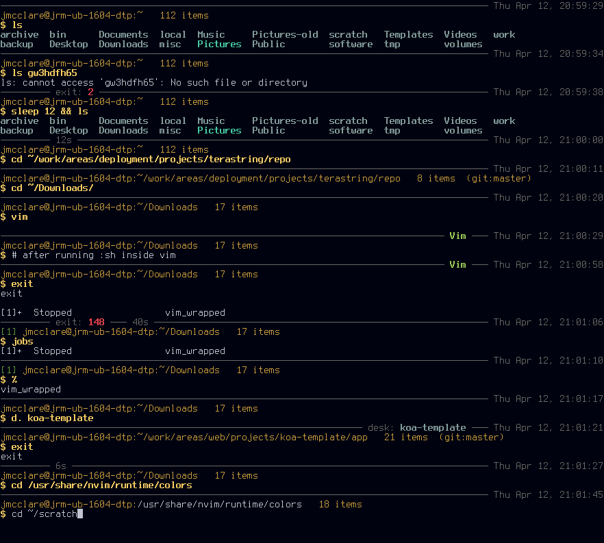

# jm-shell #

A highly informative, customized Bash shell.



Tested in:

* Ubuntu 14.04, 16.04, 18.04, 20.04, 22.04
* Mac OS 10.12


## Features ##

### Divider / Status  Line ###

This is a dark grey line that divides the last command from the prompt. It also
shows some relevent info about the last command and the current environment.

* helpful colors and divider to separate commands
* time last command finished on the right
* shows error code of last command, if any
* shows total time of last command if over 4 seconds
* indicates if inside Vim, Midnight Commander (MC), Python virtualenv (V), or [Desk](https://github.com/jamesob/desk)
* shows current system load average if over 1, in red if over 2
* shows battery charge status if laptop battery is less than full

### Current Location / Status Line ###

* shows username@hostname:path
* shows number of items in current directory
* path is in grey if not writeable
* path will drop down to the next line if it doesn’t fit
* shows number of background jobs on the left, if any
* gives info on source code repositories if current dir is in one (Subversion, Mercurial, Git)

### Prompt ###

* simple, bold yellow dollar sign
* input is standard grey while typing / autocompleting
* input is redrawn in bold yellow after entering

### Background Jobs ###

It keeps history entries unique, up to date among all open shells and with most
recent commands last (at the bottom). This is better for searching your command
history with the up arrows or `Ctrl-r`.

It also maintains a shell log file in `~/.local/share/bash/shell.log`

The regular bash history file has only unique commands for reverse history
searching. The shell log is a full history of your shell activity for
reference. It also logs a commented command to indicate new shells, closed
shells and blank lines entered.

Shell log entries look like this:

    Sun Apr  8 06:48:19 EDT 2018	/home/jmcclare	nvim ~/.config/user-dirs.dirs 

Each entry lists the time the command was entered, the command’s current
working directory, and the command. The fields are tab separated.

Both the history and the shell log file omit logging commands that begin with a
space. This is the same as Bash’s `ignorespace` or `ignoreboth` options, but it
does this no matter how those are set.

### Included Prompt Styles <a name="included-prompt-styles"></a> ###

You can set the `PROMPT_STYLE` environment variable to any of the following
values.

#### extensive ####

The style described above. This is the default style if you don’t set
`PROMPT_STYLE`.

Set `PROMPT_STYLE` to `extensive-dark` for a dark version that is more legible
on white terminal backgrounds.

#### standard and standard-mono ####

This is the default Bash prompt style configured in most default `~/.bashrc`
files.

Set `PROMPT_STYLE` to `standard` or `default` for the standard Bash color
prompt. Set it to `standard-mono` or `default-mono` for the non‐color version.

#### fast and fast-mono ####

This  the default Bash color prompt style. Setting this style also skips the
background jobs. It’s a bit better for performance on an overloaded system.

Set `PROMPT_STYLE` to `fast` for the standard Bash color prompt. Set it to
`fast-mono` for the non‐color version.

#### tweaked ####

A slight tweak of the default Bash color prompt style. Unlike the default, it
also runs the background jobs.

#### minimal ####

Nothing but a grey dollar sign prompt. Also doesn’t run the background jobs. A
bit better for performance on an overloaded system.

#### kirby ####

Turns your prompt into a dancing Kirby!

    <('.'<)
    ^('.')^
    (>'.')>
    ^('.')^

#### erection ####

Another not‐so‐useful prompt. I’ll let you guess what it looks like. Don’t use
it for too long or you’ll run out of screen space.

#### divider ####

A divider line prompt similar to the extensive style, but it uses only standard
Bash prompt variables. A bit better for performance than the extensive style.


## Installation ##

Clone this repository into a directory like `~/.local/lib/jm-shell` with:

```Bash
mkdir -p ~/.local/lib
git clone git@github.com:jmcclare/jm-shell.git ~/.local/lib/jm-shell
```

Add the following to your `~/.bashrc`

```Bash
# Source jm-shell custom prompt if it exists.
if [ -f "${HOME}/.local/lib/jm-shell/ps1" ]
then
    source "${HOME}/.local/lib/jm-shell/ps1"
fi
```

If you are using anything that adds something to your Bash `$PROMPT_COMMAND`,
like [z](https://github.com/rupa/z), make sure you source `ps1` first. It will
overwrite `$PROMPT_COMMAND`. The prompt command this PS1 adds must be the last
part of your `$PROMPT_COMMAND` unless you are appending something that runs in
a subshell (like z). See the Troubleshooting section for more.


## Configuration ##

You can set one of the other styles any time, or in your `~/.bashrc`, by
setting `PROMPT_STYLE`, like this:

```Bash
PROMPT_STYLE=kirby
```

The default prompt style is `extensive`. See the [included prompt
styles](#included-prompt-styles) above.

You can change the location and size of the shell log file by setting
`$BASHSHELLLOGFILE` and `BASHSHELLLOGFILELEN`.

```Bash
BASHSHELLLOGFILE=~/.bash-shell.log
BASHSHELLLOGFILELEN=1000000
```

The default location is `~/.local/share/bash/shell.log`

`BASHSHELLLOGFILELEN` defaults to the value of `HISTFILESIZE`, or 10000, if
`HISTFILESIZE` is not valid. If you set `BASHSHELLLOGFILELEN` to `0` it will
not log commands to the file and instead ensure it is removed.

The history updater uses the standard Bash variables `HISTFILE`,
`HISTFILESIZE`, and `HISTSIZE`. It behaves as though `HISTCONTROL` is set to
`ignoreboth:erasedups` and it does a better job than both of those options
normally do.

The default indicator for the Python virtual environment name is ‘V’ for
“virtual environment”. You can change it by setting the `PROMPT_VENV_INDICATOR`
variable.

```Bash
PROMPT_VENV_INDICATOR=venv
```

If you use a wide character like ‘🐍’ (snake) it may push the right side of the
status line off the screen. To fix this, add a space to the
`PROMPT_VENV_INDICATOR_PADDING` variable for each of these characters.

```Bash
PROMPT_VENV_INDICATOR=🐍
PROMPT_VENV_INDICATOR_PADDING=' '
```


## Troubleshooting ##

If the command is not properly redrawn in bold on the same line, or error
status codes are not shown in the status line (try entering `ls sdfgrtegre`)
you may have a problem with your `PROMPT_COMMAND` environment variable.

When you source `ps1` it sets `PROMPT_COMMAND` to `prompt_command`.
`prompt_command` is the name of the function jm-shell defines to update your
prompt after each command. You can add other things to your `PROMPT_COMMAND`
environment variable, but they must either come before the call to
`prompt_command`, or be run in a subshell.

Enter to following to see what your `PROMPT_COMMAND` environment variable is
set to:

```Bash
echo $PROMPT_COMMAND
```

For example, if you have a custom shell function `refresh_tmux_env`, you can
add it to your `PROMPT_COMMAND` like this:

```Bash
PROMPT_COMMAND="refresh_tmux_env; $PROMPT_COMMAND"
```

If you use [z](https://github.com/rupa/z) in your shell it will add a call in a
subshell to your `PROMPT_COMMAND` when you source it in your `~/.bashrc`. This
will not cause any issues for jm-shell.

Make sure you source z before sourcing the jm-shell `ps1`. The jm-shell `ps1`
will completely overwrite `PROMPT_COMMAND`.

If you source jm-shell’s `ps1`, then source `z`, your prompt command will look
like this:

```Bash
prompt_command (_z --add "$(command pwd 2>/dev/null)" 2>/dev/null &);
```

Even though the call to `_z` comes after `prompt_command`, it is run in a
subshell, so it does not interfere with jm-shell.
